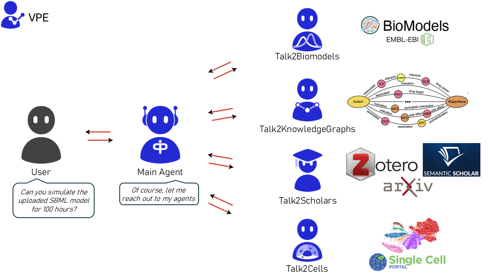

[](https://github.com/VirtualPatientEngine/AIAgents4Pharma/actions/workflows/tests_talk2biomodels.yml)
[](https://github.com/VirtualPatientEngine/AIAgents4Pharma/actions/workflows/tests_talk2cells.yml)
[](https://github.com/VirtualPatientEngine/AIAgents4Pharma/actions/workflows/tests_talk2knowledgegraphs.yml)
[](https://github.com/VirtualPatientEngine/AIAgents4Pharma/actions/workflows/tests_talk2scholars.yml)
[](https://github.com/VirtualPatientEngine/AIAgents4Pharma/actions/workflows/tests_talk2aiagents4pharma.yml)


## Introduction

Welcome to **AIAgents4Pharma** – an open-source project by [Team VPE](https://github.com/VirtualPatientEngine) that brings together AI-driven tools to help researchers and pharma interact seamlessly with complex biological data.

Our toolkit currently consists of the following agents:

- **Talk2BioModels** _(v1 released; v2 in progress)_: Engage directly with mathematical models in systems biology.
- **Talk2KnowledgeGraphs** _(v1 in progress)_: Access and explore complex biological knowledge graphs for insightful data connections.
- **Talk2Scholars** _(v1 in progress)_: Get recommendations for articles related to your choice. Download, query, and write/retrieve them to your reference manager (currently supporting Zotero).
- **Talk2Cells** _(v1 in progress)_: Query and analyze sequencing data with ease.
- **Talk2AIAgents4Pharma** _(v1 in progress)_: Converse with all the agents above (currently supports T2B and T2KG)



## Getting Started


### Installation

_Please use version 1.26.2 or later for better support with NVIDIA NIM models._

#### Option 1: PyPI


```bash
pip install aiagents4pharma
```

Check out the tutorials on each agent for detailed instructions.

#### Option 2: Docker Hub

_We now have all the agents available on Docker Hub._

##### **To run Talk2AIAgents4Pharma or Talk2KnowledgeGraphs**

Both agents require [Ollama](https://ollama.com/) to run embedding models like `nomic-embed-text`. We use a **single startup script** that automatically detects your hardware (NVIDIA, AMD, or CPU) and handles container startup, model loading, and service orchestration.

---

##### **1. Clone the repository and navigate to the agent directory**

```sh
git clone https://github.com/VirtualPatientEngine/AIAgents4Pharma

cd AIAgents4Pharma/aiagents4pharma/<agent>
```

Replace `<agent>` with either:

- `Talk2AIAgents4Pharma`
- `Talk2KnowledgeGraphs`

---

##### **2. Setup environment variables**

Copy and configure your `.env` file:

```sh
cp .env.example .env
```

Then edit `.env` and add your API keys:

```env
OPENAI_API_KEY=your_openai_api_key
NVIDIA_API_KEY=your_nvidia_api_key
```

_Notes:_

- `OPENAI_API_KEY` is required for both agents.
- `NVIDIA_API_KEY` is needed only for Talk2AIAgents4Pharma.
- `OLLAMA_HOST` is already preconfigured.
- LangSmith support is optional and can be enabled in `.env`.

---

##### **3. Start the application**

Run the startup script. It will:

- Detect your GPU (NVIDIA, AMD, or CPU)
- Choose the correct Ollama image (`latest` or `rocm`)
- Launch the Ollama container with appropriate runtime settings
- Pull the required embedding model (`nomic-embed-text`)
- Start the agent **after the model is available**

```sh
chmod +x startup.sh
./startup.sh
```

---

##### **4. Access the Web UI**

Once started, the agent is available at:

```
http://localhost:8501
```

---

##### **5. Stop or reset containers**

To stop all services:

```sh
docker compose down
```

To stop and delete volumes (e.g., model cache):

```sh
docker compose down -v
```

##### **To Run Talk2Biomodels and Talk2Scholars**

1. **Run the containers**

   ```bash
   docker run -d \
     --name talk2biomodels \
     -e OPENAI_API_KEY=<your_openai_api_key> \
     -e NVIDIA_API_KEY=<your_nvidia_api_key> \
     -p 8501:8501 \
     virtualpatientengine/talk2biomodels
   ```

   ```bash
   docker run -d \
     --name talk2scholars \
     -e OPENAI_API_KEY=<your_openai_api_key> \
     -e ZOTERO_API_KEY=<your_zotero_api_key> \
     -e ZOTERO_USER_ID=<your_zotero_user_id> \
     -p 8501:8501 \
     virtualpatientengine/talk2scholars
   ```

2. **Access the Web App**
   Open your browser and go to:

   ```
   http://localhost:8501
   ```

   _You can create a free account at NVIDIA and apply for their
   free credits [here](https://build.nvidia.com/explore/discover)._

#### **Notes**

- Ensure you **replace `<your_openai_api_key>`, `<your_nvidia_api_key>`, `<your_zotero_api_key>`, and `<your_zotero_user_id>`** with your actual credentials.
- Both applications use **port `8501`**, so run them on different ports if needed:
  ```bash
  docker run -d -e OPENAI_API_KEY=<your_openai_api_key> -p 8501:8501 virtualpatientengine/talk2scholars
  ```
  Then, access it via `http://localhost:8501`.

#### Option 3: git


1. **Clone the repository:**
   ```bash
   git clone https://github.com/VirtualPatientEngine/AIAgents4Pharma
   cd AIAgents4Pharma
   ```
2. **Install dependencies:**

   ```bash
   pip install -r requirements.txt
   ```

   ⚠️ The current version of T2KG requires additional Ollama library to be installed.

   Ollama can be easily downloaded and installed from the following link: [https://ollama.com/download](https://ollama.com/download)

   As an alternative, use the following commands to install the library using terminal and to pull necessary model:

   - Ubuntu:
     ```
     curl -fsSL https://ollama.com/install.sh | sh
     ollama pull nomic-embed-text
     ```
   - Windows:
     ```
     curl -L https://ollama.com/download/ollama-windows-amd64.zip -o ollama-windows-amd64.zip
     tar -xzf .\ollama-windows-amd64.zip
     start ollama serve
     ollama pull nomic-embed-text
     ```
   - macOS:
     ```
     brew install ollama
     ollama pull nomic-embed-text
     ```
     A list of pulled Ollama models can be checked using the following command:

   ```
   ollama list
   ```

   ⚠️ `pcst_fast 1.0.10` library requires `Microsoft Visual C++ 14.0` or greater to be installed.
   You can download `Microsoft C++ Build Tools` from [here](https://visualstudio.microsoft.com/visual-cpp-build-tools/).

3. **Initialize OPENAI_API_KEY and NVIDIA_API_KEY**

   ```bash
   export OPENAI_API_KEY=....
   export NVIDIA_API_KEY=....
   ```

   _You can create a free account at NVIDIA and apply for their
   free credits [here](https://build.nvidia.com/explore/discover)._

4. **Initialize ZOTERO_API_KEY and ZOTERO_USER_ID**

   ```bash
   export ZOTERO_API_KEY=....
   export ZOTERO_USER_ID=....
   ```

   _Please note that ZOTERO keys are requried only if you want to launch Talk2Scholars. For all the other agents, please ignore this step._

5. **[Optional] Initialize LANGSMITH_API_KEY**

   ```bash
   export LANGCHAIN_TRACING_V2=true
   export LANGCHAIN_API_KEY=<your-api-key>
   ```

   _Please note that this will create a new tracing project in your Langsmith
   account with the name `T2X-xxxx`, where `X` can be `AA4P` (Main Agent),
   `B` (Biomodels), `S` (Scholars), `KG` (KnowledgeGraphs), or `C` (Cells).
   If you skip the previous step, it will default to the name `default`.
   `xxxx` will be the 4-digit ID created for the session._

6. **Launch the app:**
   ```bash
   streamlit run app/frontend/streamlit_app_<agent>.py
   ```
   _Replace <agent> with the agent name you are interested to launch._

For detailed instructions on each agent, please refer to their respective modules.

---

## Contributing

We welcome contributions to AIAgents4Pharma! Here’s how you can help:

1. **Fork the repository**
2. **Create a new branch** for your feature (`git checkout -b feat/feature-name`)
3. **Commit your changes** (`git commit -m 'feat: Add new feature'`)
4. **Push to the branch** (`git push origin feat/feature-name`)
5. **Open a pull request** and reach out to any one of us below via Discussions:

   _Note: We welcome all contributions, not just programming-related ones. Feel free to open bug reports, suggest new features, or participate as a beta tester. Your support is greatly appreciated!_

- **Talk2Biomodels/Talk2Cells**: [@gurdeep330](https://github.com/gurdeep330) [@lilijap](https://github.com/lilijap) [@dmccloskey](https://github.com/dmccloskey)
- **Talk2KnowledgeGraphs**: [@awmulyadi](https://github.com/awmulyadi) [@dmccloskey](https://github.com/dmccloskey)
- **Talk2Scholars**: [@ansh-info](https://github.com/ansh-info) [@gurdeep330](https://github.com/gurdeep330) [@dmccloskey](https://github.com/dmccloskey)

### Current Needs

- **Beta testers** for Talk2BioModels and Talk2Scholars.
- **Developers** with experience in Python and Bioinformatics and/or knowledge graphs for contributions to AIAgents4Pharma.

Feel free to reach out to us via Discussions.

Check out our [CONTRIBUTING.md](CONTRIBUTING.md) for more information.

---

## Feedback

Questions/Bug reports/Feature requests/Comments/Suggestions? We welcome all. Please use `Issues` or `Discussions` 😀
