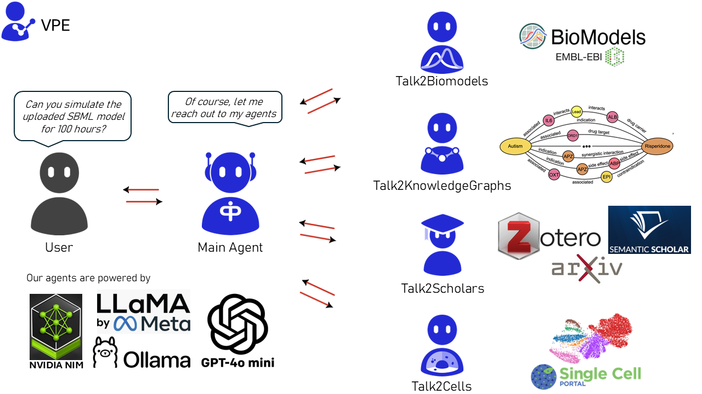

[](https://github.com/VirtualPatientEngine/AIAgents4Pharma/actions/workflows/tests_talk2biomodels.yml)
[](https://github.com/VirtualPatientEngine/AIAgents4Pharma/actions/workflows/tests_talk2cells.yml)
[](https://github.com/VirtualPatientEngine/AIAgents4Pharma/actions/workflows/tests_talk2knowledgegraphs.yml)
[](https://github.com/VirtualPatientEngine/AIAgents4Pharma/actions/workflows/tests_talk2scholars.yml)
[](https://github.com/VirtualPatientEngine/AIAgents4Pharma/actions/workflows/tests_talk2aiagents4pharma.yml)


## Introduction

Welcome to **AIAgents4Pharma** – an open-source project by [Team VPE](https://bmedx.com/research-teams/artificial-intelligence/team-vpe/) that brings together AI-driven tools to help researchers and pharma interact seamlessly with complex biological data.

Our toolkit currently consists of the following agents:

- **Talk2BioModels** _(v1 released; v2 in progress)_: Engage directly with mathematical models in systems biology.
- **Talk2KnowledgeGraphs** _(v1 in progress)_: Access and explore complex biological knowledge graphs for insightful data connections.
- **Talk2Scholars** _(v1 in progress)_: Get recommendations for articles related to your choice. Download, query, and write/retrieve them to your reference manager (currently supporting Zotero).
- **Talk2Cells** _(v1 in progress)_: Query and analyze sequencing data with ease.
- **Talk2AIAgents4Pharma** _(v1 in progress)_: Converse with all the agents above (currently supports T2B and T2KG)



## Getting Started

### Installation

#### Option 1: Docker (stable-release)

_We now have all the agents available on Docker Hub._

##### **To run Talk2AIAgents4Pharma / Talk2KnowledgeGraphs**

Both agents require [Ollama](https://ollama.com/) to run embedding models like `nomic-embed-text`. We use a **single startup script** that automatically detects your hardware (NVIDIA, AMD, or CPU) and handles container startup, model loading, and service orchestration.

##### **1. Clone the repository and navigate to the agent directory**

```sh
git clone https://github.com/VirtualPatientEngine/AIAgents4Pharma

cd AIAgents4Pharma/aiagents4pharma/<agent>
```

Replace `<agent>` with either:

- `talk2aiagents4pharma`
- `talk2knowledgegraphs`

##### **2. Setup environment variables**

Copy and configure your `.env` file:

```sh
cp .env.example .env
```

Then edit `.env` and add your API keys:

```env
OPENAI_API_KEY=...                  # Required for both agents
NVIDIA_API_KEY=...                  # Required for both agents
OLLAMA_HOST=http://ollama:11434     # Required for AA4P / T2KG
LANGCHAIN_TRACING_V2=true           # Optional for both agents
LANGCHAIN_API_KEY=...               # Optional for both agents
```

_To use **Talk2AIAgents4Pharma** / **Talk2KnowledgeGraphs**, you'll need a free NVIDIA API key. You can create an NVIDIA account and apply for free credits [here](https://build.nvidia.com/explore/discover)._  
 _LangSmith support is optional. If you'd like to enable it, you can get your API key [here](https://docs.smith.langchain.com/administration/how_to_guides/organization_management/create_account_api_key)._

##### **3. Start the application**

Run the startup script. It will:

- Detect your hardware configuration (NVIDIA GPU, AMD GPU, or CPU). Apple Metal is unavailable inside Docker, and Intel SIMD optimizations are automatically handled without special configuration.
- Choose the correct Ollama image (`latest` or `rocm`)
- Launch the Ollama container with appropriate runtime settings
- Pull the required embedding model (`nomic-embed-text`)
- Start the agent **after the model is available**

```sh
chmod +x startup.sh
./startup.sh        # Add --cpu flag to force CPU mode if needed
```

##### **4. Access the Web UI**

Once started, the agent is available at:

```
http://localhost:8501
```

---

##### **To Run Talk2Biomodels / Talk2Scholars**

1. **Run the containers**

###### talk2biomodels

```docker
docker run -d \
  --name talk2biomodels \
  -e OPENAI_API_KEY=<your_openai_api_key> \
  -e NVIDIA_API_KEY=<your_nvidia_api_key> \
  -p 8501:8501 \
  virtualpatientengine/talk2biomodels
```

###### talk2scholars

```docker
docker run -d \
  --name talk2scholars \
  -e OPENAI_API_KEY=<your_openai_api_key> \
  -e ZOTERO_API_KEY=<your_zotero_api_key> \
  -e ZOTERO_USER_ID=<your_zotero_user_id> \
  -e NVIDIA_API_KEY=<your_nvidia_api_key> \
  -p 8501:8501 \
  virtualpatientengine/talk2scholars
```

2. **Access the Web App**
   Open your browser and go to:

   ```
   http://localhost:8501
   ```

   _To use **Talk2BioModels** / **Talk2Scholars**, you'll need a free NVIDIA API key. You can create an NVIDIA account and apply for free credits [here](https://build.nvidia.com/explore/discover)._  
   _To use **Talk2Scholars**, you'll need a Zotero API key. You can generate one [here](https://www.zotero.org/user/login#applications). For all other agents, these keys are not required._  
   _LangSmith support is optional. If you'd like to enable it, you can get your API key [here](https://docs.smith.langchain.com/administration/how_to_guides/organization_management/create_account_api_key)._

#### Notes

- Be sure to **replace the placeholder values** with your actual credentials before running any container:

  - `<your_openai_api_key>`
  - `<your_nvidia_api_key>`
  - `<your_zotero_api_key>`
  - `<your_zotero_user_id>`

- All agents default to **port `8501`**. If you plan to run multiple agents simultaneously, make sure to assign **different ports** to avoid conflicts.

  Example (Talk2Scholars on port `8502`):

  ```docker
  docker run -d \
    --name talk2scholars \
    -e OPENAI_API_KEY=<your_openai_api_key> \
    -e ZOTERO_API_KEY=<your_zotero_api_key> \
    -e ZOTERO_USER_ID=<your_zotero_user_id> \
    -e NVIDIA_API_KEY=<your_nvidia_api_key> \
    -p 8502:8501 \
    virtualpatientengine/talk2scholars
  ```

  Then access the app at: [http://localhost:8502](http://localhost:8502)

---

#### Option 2: git (for developers and contributors)


1. **Clone the repository:**
   ```sh
   git clone https://github.com/VirtualPatientEngine/AIAgents4Pharma
   cd AIAgents4Pharma
   ```
2. **Install dependencies:**

   ```python
   pip install -r requirements.txt
   ```

3. **Initialize API Keys**

   ```env
   export OPENAI_API_KEY=....          # Required for all agents
   export NVIDIA_API_KEY=....          # Required for all agents
   export ZOTERO_API_KEY=....          # Required for T2S
   export ZOTERO_USER_ID=....          # Required for T2S
   export LANGCHAIN_TRACING_V2=true    # Optional for all agents
   export LANGCHAIN_API_KEY=...        # Optional for all agents
   ```

   _To use **Talk2AIAgents4Pharma** / **Talk2BioModels** / **Talk2KnowledgeGraphs** / **Talk2Scholars**, you'll need a free NVIDIA API key. You can create an NVIDIA account and apply for free credits [here](https://build.nvidia.com/explore/discover)._  
   _To use **Talk2Scholars**, you'll need a Zotero API key. You can generate one [here](https://www.zotero.org/user/login#applications). For all other agents, these keys are not required._  
   _To use **Talk2KnowledgeGraphs (T2KG)**, you'll need:_  
   _**Ollama installed** on your machine. Follow the instructions based on your OS from [here](https://ollama.com/download)._  
   _After installing Ollama, **pull the `nomic-embed-text` model** and start the server by running:_

   ```sh
   ollama pull nomic-embed-text && ollama serve
   ```

   _More details about the model are available [here](https://ollama.com/library/nomic-embed-text)._

_Additionally on Windows, the `pcst_fast 1.0.10` library requires **Microsoft Visual C++ 14.0 or greater**._  
 _You can download the Microsoft C++ Build Tools [here](https://visualstudio.microsoft.com/visual-cpp-build-tools/)._  
 _LangSmith support is optional. If you'd like to enable it, you can get your API key [here](https://docs.smith.langchain.com/administration/how_to_guides/organization_management/create_account_api_key)._

_Please note that this will create a new tracing project in your Langsmith
account with the name `T2X-xxxx`, where `X` can be `AA4P` (Main Agent),
`B` (Biomodels), `S` (Scholars), `KG` (KnowledgeGraphs), or `C` (Cells).
If you skip the previous step, it will default to the name `default`.
`xxxx` will be the 4-digit ID created for the session._

4. **Launch the app:**
   ```sh
   streamlit run app/frontend/streamlit_app_<agent>.py
   ```
   _Replace `<agent>` with the agent name you are interested to launch:_

- `talk2aiagents4pharma`
- `talk2biomodels`
- `talk2knowledgegraphs`
- `talk2scholars`
- `talk2cells`

For detailed instructions on each agent, please refer to their respective modules.

---

#### Option 3: pip (beta-release)


```python
pip install aiagents4pharma
```

Check out the tutorials on each agent for detailed instructions.

---

## Contributing

We welcome contributions to AIAgents4Pharma! Here’s how you can help:

1. **Fork the repository**
2. **Create a new branch** for your feature (`git checkout -b feat/feature-name`)
3. **Commit your changes** (`git commit -m 'feat: Add new feature'`)
4. **Push to the branch** (`git push origin feat/feature-name`)
5. **Open a pull request** and reach out to any one of us below via Discussions:

   _Note: We welcome all contributions, not just programming-related ones. Feel free to open bug reports, suggest new features, or participate as a beta tester. Your support is greatly appreciated!_

- **Talk2Biomodels/Talk2Cells**: [@gurdeep330](https://github.com/gurdeep330) [@lilijap](https://github.com/lilijap) [@dmccloskey](https://github.com/dmccloskey)
- **Talk2KnowledgeGraphs**: [@awmulyadi](https://github.com/awmulyadi) [@dmccloskey](https://github.com/dmccloskey)
- **Talk2Scholars**: [@ansh-info](https://github.com/ansh-info) [@gurdeep330](https://github.com/gurdeep330) [@dmccloskey](https://github.com/dmccloskey)

### Current Needs

- **Beta testers** for Talk2BioModels and Talk2Scholars.
- **Developers** with experience in Python and Bioinformatics and/or knowledge graphs for contributions to AIAgents4Pharma.

Feel free to reach out to us via Discussions.

Check out our [CONTRIBUTING.md](CONTRIBUTING.md) for more information.

---

## Feedback

Questions/Bug reports/Feature requests/Comments/Suggestions? We welcome all. Please use `Issues` or `Discussions` 😀
