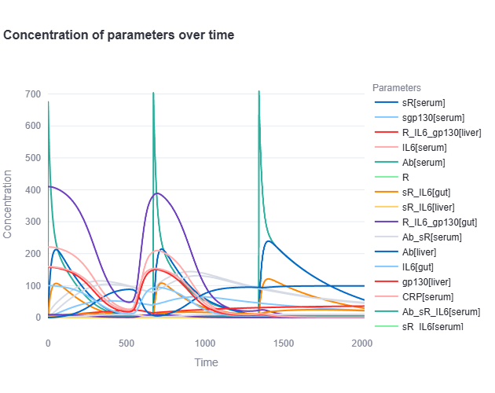
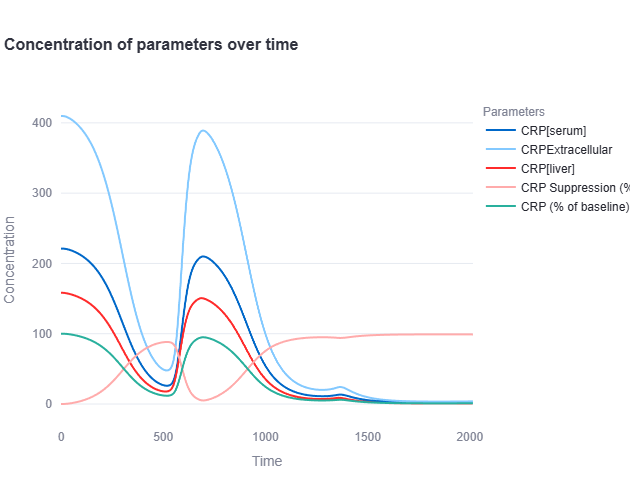

# T2B sample use case #1
## Human disease model with drug treatment assessment: Crohns IL6 Disease

> Dwivedi G, Fitz L, Hegen M, Martin SW, Harrold J, Heatherington A, Li C. (2014). A multiscale model of interleukin-6-mediated immune regulation in Crohn's disease and its application in drug discovery and development. *CPT Pharmacometrics Syst Pharmacol*, 3(1):e89. doi: 10.1038/psp.2013.64. [PMID: 24402116](https://pubmed.ncbi.nlm.nih.gov/24402116/)

**Model**: [BIOMD0000000537](https://www.ebi.ac.uk/biomodels/BIOMD0000000537)

<hr>

**Question 1:** Search for all models related to a disease/research term <br>
```Please search for all the biomodels on Crohns Disease```

**Answer 1:** 
>| # | BioModel ID | BioModel Name | Format | Submission Date |
>|---|-------------|---------------|---------|-----------------|
>| 1 | BIOMD0000000535 | Dwivedi2014 - Crohns IL6 Disease model - Anti-IL6 Antibody | SBML | 2014-08-04 |
>| 2 | BIOMD0000000536 | Dwivedi2014 - Crohns IL6 Disease model - sgp130 activity | SBML | 2014-08-04 |
>| 3 | BIOMD0000000537 | Dwivedi2014 - Crohns IL6 Disease model - Anti-IL6R Antibody | SBML | 2014-08-04 |


**Q2:** Describe a model (the IL6 model for IBD) <br>
```Briefly describe the biomodel 537```

**A2:**

> BioModel 537 (Dwivedi2014 - Crohns IL6 Disease model - Anti-IL6R Antibody) presents a multiscale systems model examining interleukin-6 (IL-6)-mediated immune regulation in Crohn's disease. The model integrates intracellular signaling with organ-level pharmacological marker dynamics and evaluates different biotherapeutic strategies targeting IL-6 signaling. It specifically analyzes ligand activity effects on IL-6 signaling and downstream impacts on STAT3 activity and CRP expression. Key findings suggest dual targeting of the IL-6/sIL-6R complex plus IL-6 or IL-6R provides superior suppression of Crohn's disease pharmacological markers versus alternative approaches (see Figures 3a, 4d, 4e, 4f, and 5b). Source: BioModels Database, ID: 537.

**Q3.** Ask about publication data of the model (It will remember the model number) <br>
```When and where was the biomodel published?```

**A3:**

> The biomodel 537 was published on January 8, 2014.

**Q4.** Display all parameters related to drug dosage. `Dose`=dosage every 4 weeks. `DoseQ2W`=dosage every 2 weeks. According to the article, by default `DoseQ2W` is
deactivated. <br>
```Show me the parameters related to drug dosage in the model.```

**A4:** <br>
> The parameters related to drug dosage in the model include:
> - Dose
> - DoseQ2W (Dose every two weeks)
> - Initial for CRP
> - Initial for DoseQ2W
> - Initial for Dose


**Q5.** Simulate the model for 12 weeks = 2016 hours, and give it a name. <br>
```Simulate the model for 2016 hours and interval of 2016 hours.```
```Mark this simulation and its follow-up questions as `Treatment 4wk` ```
```in your memory.```

**A5:**
>The simulation for the model 537 has been successfully completed for a duration of 2016 hours with an interval of 2016 hours. This simulation is now marked as Treatment 4wk in my memory.



**Q6.** Show only CRP-related species, as it is one of the clinically-relevant measurement for a successful treatment. <br>
```Plot only CRP related species```

**A6:**
>The plot for the concentration of C-Reactive Protein (CRP) related species from the simulation results of Treatment 4wk has been successfully created. The following species were included in the plot:
> - CRP[serum]
> - CRPExtracellular
> - CRP[liver]
> - CRP Suppression (%)
> - CRP (% of baseline)



**Q7.** Show CRP[serum] concentration <br>
```What is the `CRP[serum]` concentration after 1000 time points?```

**Q8.** Redo the simulation by activating the `DoseQ2W` and deactivating `Dose` parameters <br>  
```Simulate the model again for 2016 hours and intervals 2016 with an initial concentration of `DoseQ2W` set to 300 and `Dose` set to 0.```
```Mark this simulation and its follow-up questions as `Treatment 2wk` ```
```in your memory.```

**Q9.** Show only CRP-related species because that's one of the biomarkers the authors were interested in. <br>  
```Plot only CRP related species.```

**Q10.** Show CRP[serum] concentration <br>
```Great, What is the `CRP[serum]` concentration after 1000 time points?```

**Q11.** Compare the CRP values in the 2 cases. Treatment 2wk is better than Treatment 4wk. <br>
```Based on the CRP values, which treatment would you recommend? `Treatment 4wk` or `Treatment 2wk`?```

<hr>

