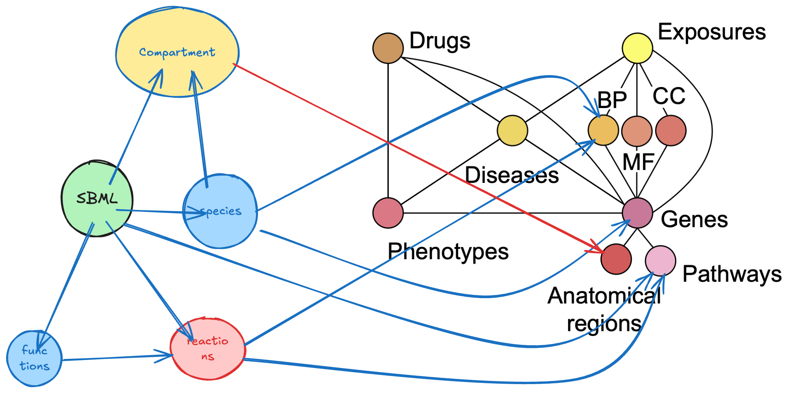

# Annotating SBML Models using LLMs and Integrating them with Biomedical Knowledge Graphs

## SBML Background

Systems Biology Markup Language (SBML) is an XML-based format for representing computational models of biological processes. SBML models are composed of several key components:

- **Species**: Biological entities such as proteins, genes, or metabolites
- **Compartments**: Physical locations where species exist (cells, organelles, tissues)
- **Reactions**: Processes that transform species (binding, phosphorylation, etc.)
- **Parameters**: Numerical values that define reaction rates and other properties
- **Rules**: Mathematical expressions that govern system behavior
- **Functions**: Reusable mathematical expressions

SBML is fundamentally designed to capture dynamic biological processes, focusing on the time-dependent behavior of biological systems. It represents biological entities in specific states within specific contexts, allowing for simulation of how these entities change over time.

## Biomedical Knowledge Graphs Background

Biomedical Knowledge Graphs (BKGs) are structured networks that represent biological knowledge as nodes (entities) connected by edges (relationships). Unlike SBML, BKGs are primarily focused on organizing static knowledge rather than dynamic processes.

PrimeKG, for example, is composed of:

- **Nodes**: Biological entities from various ontologies (genes, diseases, drugs, etc.)
- **Edges**: Relationships between entities (causes, treats, interacts with, etc.)
- **Node attributes**: Properties like ontology IDs, names, descriptions
- **Edge attributes**: Relationship types, evidence scores, sources

BKGs integrate information from multiple data sources and ontologies, including:
- Gene Ontology (GO)
- MONDO Disease Ontology
- Human Phenotype Ontology (HPO)
- UMLS
- DrugBank
- REACTOME

## The Fundamental Difference

The key difference between SBML and BKGs lies in their purpose and representation:

- **SBML models are highly localized and context-dependent**. They represent biological entities in specific states, compartments, and times to capture dynamic behavior.
- **BKGs are generalized knowledge repositories**. They represent canonical entities and relationships without necessarily specifying contexts, states, or temporal characteristics.

## Integration Concept: Contextualized Entities

To bridge these different representations, we can think of SBML species as "contextualized entities" that break down into three dimensions:

1. The biological entity itself
2. Its compartmental context
3. Its specific state

For example, consider `pSTAT3{liver}` from the model:

- **Entity**: STAT3 (Signal transducer and activator of transcription 3)
- **Compartment**: Liver
- **State**: Phosphorylated

In a BKG like PrimeKG, this single SBML species would map to multiple nodes and relationships:
- A node for STAT3 (gene/protein)
- A node for liver (anatomy)
- A node for phosphorylation (biological process)
- Relationships connecting these nodes

This creates a one-to-many mapping where a single SBML species corresponds to a subgraph within the BKG.

Other examples from your model demonstrate this complexity:
- `IL6{serum}`: The cytokine IL-6 in the blood circulation context
- `sR_IL6_gp130{gut}`: A complex of soluble IL-6 receptor, IL-6, and gp130 in the gut compartment

## Integration Challenges

This "contextualized entity" approach highlights several challenges:
1. SBML species often represent transient states that may not exist as explicit nodes in BKGs
2. The temporal dynamics captured in SBML are typically not represented in BKGs
3. The highly specific contexts of SBML species may require creating new relationships in the BKG

Despite these challenges, integrating SBML with BKGs offers tremendous potential for enhancing model annotations, enabling broader biological insights, and connecting mechanistic models to wider biological knowledge.

## Proposing A Unifying Framework: SBML models as first-class nodes in a KG

We propose a novel framework that integrates Systems Biology Markup Language (SBML) models directly into Biomedical Knowledge Graphs (BKGs) through a structured ontological approach. Rather than treating SBML models as separate entities, we represent them as interconnected subgraphs within the larger knowledge ecosystem.

In this framework:

1. **SBML models become first-class nodes** in the BKG
2. **Model components** (species, compartments, reactions) become nested nodes connected to their parent model
3. **Species nodes form bridge connections** to:
   - Biological entities (genes, proteins) they represent
   - Anatomical locations (compartments) where they exist
   - Biological processes that define their state
   - Pathways they participate in

## Methodology for SBML Model Annotation

We developed a multi-step process to generate comprehensive annotations for the SBML model species:

1. **Text Extraction**: We performed [high-quality Optical Character Recognition (OCR)](https://olmocr.allenai.org/) on the reference paper to extract detailed descriptions of the biological system.

2. **LLM-Based Entity Recognition**: Using the species list from the empty SBML model as input, we prompted Claude 3.7 (a reasoning-focused LLM) to analyze the extracted text and infer structured species names and descriptions for each model component.

3. **Annotation Enrichment**: From this foundation, we pursued two parallel approaches for ontological annotation and knowledge graph integration:
   - **Bio-Ontology API Approach**: Mapping species to standardized ontologies used in PrimeKG
   - **UMLS Mapping Approach**: Extracting Unified Medical Language System codes to connect with biomedical knowledge resources

This process created a bridge between the mathematical representation in the SBML model and the broader biological context represented in knowledge graphs, enabling richer interpretation of simulation results and model components.

## Connecting to PrimeKG

The annotations generated can be directly used to connect the SBML model components to PrimeKG:

1. **Via ontology IDs**: The Bio-Ontology approach uses the same ontologies as PrimeKG
2. **Via UMLS codes**: PrimeKG provides UMLS mappings for its nodes as described in:
   Su, X., Messica, S., Huang, Y., Johnson, R., Fesser, L., Gao, S., Sahneh, F. and Zitnik, M., 2025. Multimodal Medical Code Tokenizer. arXiv preprint arXiv:2502.04397

## Files

#### Input
- `Dwivedi_Model537_empty.xml`: Original SBML model without annotations
- `Dwivedi_Model537_Source_Article.txt`: Text of the reference paper

#### Output
- `species_dict.json`: Dictionary mapping species display names to descriptions from reasoning LLM
- `species_dict_annotated.json`: Species dictionary enriched with ontology annotations
- `species_dict_umls.json`: Species dictionary with UMLS codes

#### Scripts
- `bioontology_api.py`: Custom module for interacting with Bio-Ontology API
- `extract_umls.py`: Custom module for extracting UMLS codes with scispacy
