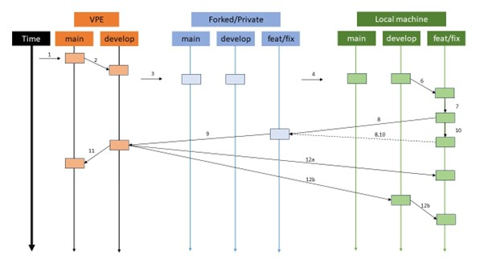
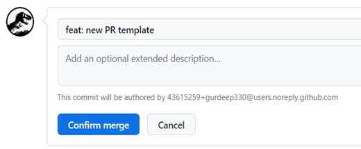
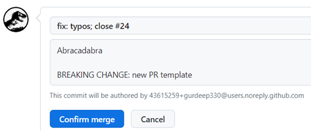
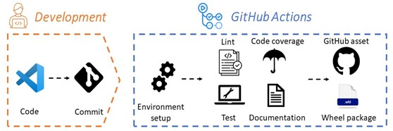
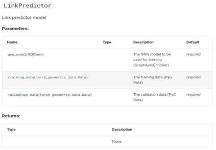
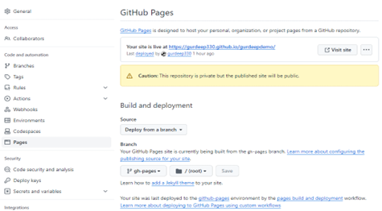
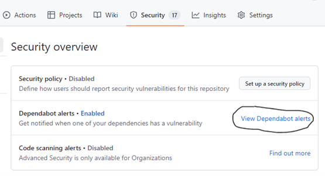
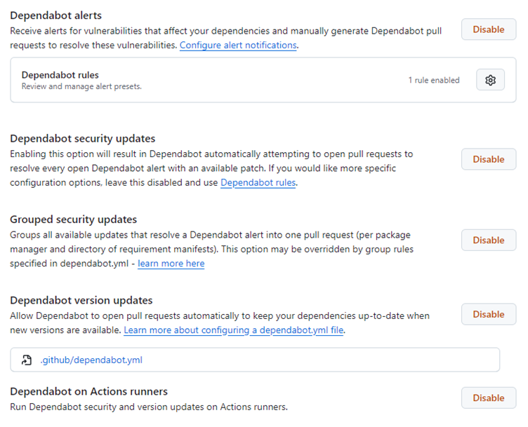
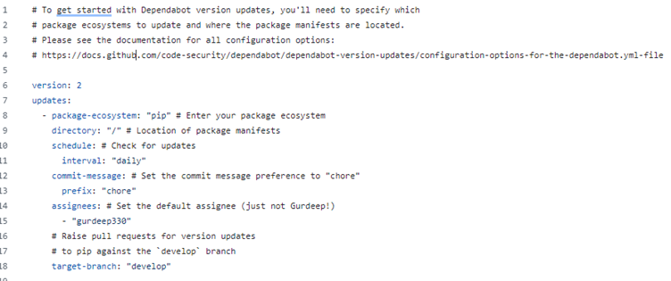
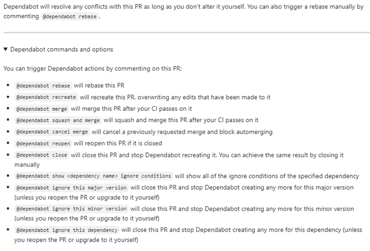

---
hide:
  - navigation
  - toc
---

# <font color=black>DevOps</font>
> <font color=black>ℹ️</font><br>
> **Date** 2024-11-02<br>
> **Version** 1.0<br>

1. [Introduction](#Introduction)
2. [Feedback and Issue Reporting](#feedback-and-issue-reporting)
3. [GitHub Repo Creation Workflow](#github-repo-creation-workflow)
4. [How to open and close a Pull request (PR)](#how-to-open-and-close-a-pull-request-pr)
5. [Environment](#environment)
6. [CI/CD pipeline](#cicd-pipeline)
7. [MkDocs for Documentation](#mkdocs-for-documentation)
8. [Automated workflows for testing, documentation, and release](#automated-workflows-for-testing-documentation-and-release)
 
## Introduction
Welcome to Team VPE's DevOps document! This document serves as a guide to our team's approach to managing the DevOps practices within our projects. Your insights and feedback are highly encouraged 😊 (refer section 2)<br>
🗸 **GitHub repo creation & workflow**: A table and schema on how to repo operation on GitHub<br>
🗸 **Environment**: How to create a virtual environment for your projects.<br>
🗸 **CI/CD pipeline**: About workflow on software development cycle.<br>
🗸 **MkDocs for Documentation**: How we leverage MkDocs for automating the documentation process for code (shareable) repositories.<br>
🗸 **Automated Workflows with GitHub Actions**: About the implementation of automated workflows using GitHub Actions, streamlining tasks such as testing, linting, code coverage, and version releases.<br>

## Feedback and Issue Reporting
Please provide feedback directly in the document for documentation improvements. For new features or bug reports in the repositories, please submit them via GitHub Issues. I’ll get back to you as soon as your input is resolved. Thanks 😊.

## GitHub Repo Creation Workflow
In the table and schema below, you will find step-by-step instructions on how to fork a repo from the VPE team account to your private account, and then clone it onto your local machine for coding/development purposes.



| Step | How to do? |
| ---- | ---------- |
| 1. Fork the repo to your private account | On GitHub see [forking a repository](https://help.github.com/articles/fork-a-repo/) |
| 2. Clone the forked repo to your local machine | `git clone https://github.com/fork/repo`1️⃣ |
| 3. Configure Git to sync your fork (i.e. private account) with the original repo (i.e. VPE account) | `git remote add upstream https://github.com/original.git`1️⃣<br>`git remote -v` |
| 4. Create new feature/fix branch | `git checkout -b feat` OR<br>`git checkout -b fix` |
| 5. Add changes to the new branch and commit the changes | `git add .`<br>`git commit -m ‘feat: added new changes’` |
| 6. Push the changes to your fork (i.e. private account) | `git push origin feat` OR<br>`git push origin fix` |
| 7. Create a new pull-request (PR) on GitHub (private account) | See [creating a pull request](https://help.github.com/articles/creating-a-pull-request/). Follow the PR template.<br>Merge “feat/fix” on private account with “develop” on VPE account |
| 8. Continue to make changes on your branch during code review (steps 6-8) | Min 1 approving review and pass all CI tests required to merge |
| 9. Create a new pull-request (PR) on GitHub (VPE account) | Follow PR template.<br>Merge “develop” on VPE account with “main” on VPE account |
| 10a. Update your local feat/fix branch with recent changes from dev branch on VPE account | `git checkout feat` OR `git checkout fix`<br>`git fetch upstream –prune`2️⃣<br>`git merge upstream/feat` OR `git merge upstream/fix` |
| 10b. Update your local develop branch with recent changes from develop branch on VPE account (and then create a feat/fix branch out of it) | `git checkout develop`<br>`git fetch upstream --prune`<br>`git merge upstream/develop` |
| 11. Delete the local feat/fix branch (optional) | `git checkout develop`<br>`git branch -d feat` OR `git branch -d fix` |

1️⃣ Set this based on your cloning method (HTTPS or SSH)<br>
2️⃣ Typically used to update your local repository with changes from all remotes while also removing any local references to branches that have been deleted on the remote repository.
 
*Note: When forking a repository, you can choose to clone just the main branch or all branches including the development branch. If you wish to develop the repository further, it's recommended to clone the main and develop branches. If you are not the owner of the repository, it's advisable to communicate with the repository owner before making significant changes.*

## How to open and close a Pull request (PR)
### Some general recommendations
1. Assign a single PR to each task. Avoid including unrelated changes in the same pull request to maintain focus and clarity.
2. Follow the Pull Request templates for both shareable code and experiments conducted on Code Ocean (provided alongside most of the templates on our GitHub Teams page).
3. Title and description serve as the initial means to explain the rationale behind each change.
4. Clearly state the purpose and objectives of the pull request to provide context for reviewers.
5. Break down changes into logically organized, bite-sized commits for easier review.
6. Ensure that each commit follows consistent coding conventions and standards (see the section on Coding practices in the CodeOps guide).
7. Include comprehensive test cases that cover both positive and negative scenarios (and edge/corner cases) and run them locally before creating the PR (see the section on Automated workflows for testing, documentation, and release in this guide).
8. Provide documentation updates alongside code changes to keep it synchronized (see the section on MkDocs for documentation in this guide)

### To open a PR, authors are required to:
1. Provide a title and description of the PR.
2. Make sure the change checks every item mentioned on the checklist in the PR template. If not, please specify the reasons in your PR.

### To close a PR, reviewers are required to:
1. Make sure the PR passes the automated tests (if applicable).
2. Make sure every item mentioned on your checklist in the template is addressed.
3. If the PR merges develop into main, please make sure to add a prefix (feat:/fix:/chore:) and/or a suffix BREAKING CHANGE (if it's a major release) to your commit message.

<br>
For instance, the commit message triggers a merge followed by the automated activation of the versioning tool (semantics-release). This tool increments the minor version (e.g., 2.1.1 changes to 2.2.0). 

<br>
Another instance, the commit message triggers a merge followed by the automated activation of the versioning tool (semantics-release). This tool increments the major version (e.g., 2.1.1 changes to 3.0.0).

4. If the PR closes an issue(s), please make sure to state it in your commit message. 

<br>
For instance, the commit message below triggers a merge followed by the automated activation of the versioning tool (semantics-release) and automatically closes issue #24.
 
5. If the PR merges develop into main and it is supposed to run an automated release workflow, please make sure to check under the Actions tab to see if the workflow has been initiated and return later to verify that it has completed successfully.

## Environment
Here's a quick documentation on how to install a Python environment using venv:

1. Create a Virtual Environment:

        1. Open a terminal or command prompt.
        2. Navigate to your project directory.
        3. Run the following command to create a virtual environment: `python -m venv env`
        4. This command creates a folder named `env` which contains the isolated Python environment.

2. Activate the Virtual Environment:

        1. Activate the virtual environment by running the appropriate command based on your operating system: `.\env\Scripts\activate` (Windows) `source env/bin/activate` (MacOS and Linux)
        2. After activation, you'll notice `(env)` at the beginning of your command prompt, indicating that you are now working within the virtual environment.

3. Install dependencies: with the virtual environment activated, you can now install Python packages without affecting the global Python installation. Install the required packages using `pip`. For example: `pip install package1 package2`
4. Install dependencies from `requirements.txt`: `pip install -r requirements.txt`
5. Save dependencies to `requirements.txt` (useful when setting up a project for the first time after installing several libraries via pip): `pip freeze > requirements.txt`
6. Install a distributable package (.whl file) from another Team VPE repository if it's not yet released on PyPI: `git clone https://github.com/VirtualPatientEngine/demo.git` and `cd demo/dist/ && pip3 install demo-latest-py3-none-any.whl`

*NOTE: By default, when you run git clone, it clones the entire repository, including all branches. However, it typically checks out the main branch after cloning*. If you want to install the package from a specific branch, either simply checkout to the branch: `git checkout develop`. Or use the -b flag followed by the branch name during git clone: `git clone -b develop https://github.com/VirtualPatientEngine/demo.git`. In Code Ocean, to implement the commands mentioned above, include them in the postInstall script.

7. Verify installation: `pip list`
8. Deactivate the Virtual Environment and return to the global Python environment, simply run: `deactivate`

That's it! You've successfully installed a Python environment using `venv` and recreated an existing environment from `requirements.txt`.

## CI/CD pipeline
A Continuous Integration/Continuous Deployment (CI/CD) pipeline is crucial for streamlining the software development lifecycle and delivering reliable and high-quality code.
 
<br>
The schema above provides an overview of the two phases of our CI/CD pipeline. It's essential to note that the CI/CD pipeline applies exclusively to code/shareable repositories.

### Development: 
The process begins with developers writing and committing code to GitHub

### GitHub Actions:
This phase involves:
1. Automating the setup of the environment, conducting tests, linting, and assessing code coverage. This is essential for maintaining code quality and ensuring that the code adheres to predefined standards.
2. Additionally, automatic document deployment (via MkDocs and GitHub pages) is initiated during this stage.
3. The final steps involve the release of the code through GitHub assets and wheel packages, facilitating seamless distribution of the shareable code.

## MkDocs for Documentation
### Why MkDocs?
1. MkDocs produces static pages from Markdown.
2. It pulls in code documentation from docstrings using a plug-in mkdocstrings.
3. Offers various themes to make your documentation look pretty.
4. Host your documentation on GitHub Pages
5. Automate code documentation using GitHub Actions

### How to implement MkDocs?
#### Docstrings
Make sure for every method and class you define, there is a docstring (would be awesome if you specify the examples, arguments and returns in the docstring – mkdocs can fetch that info too!)

```
def __init__(self, gnn_model,
               training_data,
               validation_data
               ) -> None:
       '''
       Initializes the link predictor model

       Args:
           gnn_model(GCNConv): The GNN model to be used for training (GraphAutoEncoder)
           training_data(torch_geometric.data.Data): The training data (PyG Data)
           validation_data(torch_geometric.data.Data): The validation data (PyG Data)

       Returns:
           None
       '''
```

<br>
The above docstring should produce the image in the documentation. 

#### In the docs/ folder:
1. Create an index.md file that contains information to be shown on the index page of the documentation.
2. Next, create a markdown file for every class or set of methods you want to document.
3. Within each markdown file, specify the name of the class or set of methods you want to be automatically read `:::folderName.module` e.g.: `:::tests.uniprot` where tests is a folder that contains the module uniprot.py. Note: You can also add additional text (in markdown format) in the file besides the syntax above
4. Open the file mkdocs.yml Add the paths to folders that contain the python code you want to document under the plugins (“app” & “tests” are added by default)
5. Under nav (navigation), set `<pageName>: <file.md>` where pageName is the name of the page you’d like to assign and file.md is the file you created for the corresponding class/methods in the previous step. NOTE: You'll need to create the markdown files initially to set up a template. Afterwards, you'll only need to do this again if you've added a new script file or made significant modifications.

#### To view it locally
run `mkdocs serve in your terminal.`

#### To host it online:
1. Ensure that the workflow file mkdocs-deploy.yml is placed in the folder .github/workflows. You can find a copy of this file in the demo repo. You can use the copy as it is without the need for editing.
2. Commit and push your code to GitHub (make sure you have followed the instructions above).
3. Under the Actions tab, you'll find the ongoing mkdocs-deploy.yml workflow. Once this workflow finishes, head over to the Settings tab and click on Pages. From there, choose Deploy from a branch in the Source section. Under the Branch subsection, select gh-pages and root from the dropdown menus, then click Save.
4. Wait until your website gets published (~30 seconds). Once it's ready, you can locate the URL to your site at the top of the page.
<br><br>
5. From now on, whenever you commit and push your code to GitHub, this workflow will automatically execute, updating the documentation hosted at the provided URL.
6. The mkdocs-deploy.yml workflow will run only when the code is pushed to GitHub on the main branch. You can edit the workflow file to introduce changes.

## Automated workflows for testing, documentation, and release
- A workflow is a configurable automated process that will run one or more jobs.
- Workflows are defined by a YAML file checked in to your repository and will run when triggered by an event in your repository, or they can be triggered manually, or at a defined schedule.
- Workflows are defined in the .github/workflows directory in a repository, and a repository can have multiple workflows, each of which can perform a different set of tasks. For example, you can have one workflow to build and test pull requests, another workflow to deploy your application every time a release is created, and still another workflow that adds a label every time someone opens a new issue
- It is recommended to use the following 3 workflows for every repo that we develop. You can use them as templates to write additional workflows. If you use the demo repo as a template (recommended), you will find these workflows already present.
- Check out the section “Testing locally” in the CodeOps guide should you want to run these tests locally before pushing your code to GitHub.

### TESTS (tests.yaml): 
This workflow will run three jobs:

#### pytest:
- Job: test scripts in the tests/ folder
- Triggered by: pull_request on main or develop

```
pytest
```

- Passing-criteria: pass all the tests
- Branches: main, develop

NOTE: Running pytest without any options can sometimes execute all the python files, including unintended ones. To avoid this, you can specify the folders you want to test. For example, running > pytest tests/ will execute pytest only on the tests/ folder. It is important to ensure that pytest is run on at least the app/ and tests/ folders. Additionally, if you choose to run pytest on specific folders in the automated workflows, you must also do the same while testing locally (see the section on Testing locally in the CodeOps guide).

#### pylint:
- Action: lint all *.py scripts in the specified folder
- Triggered by: pull_request on main or develop

```
pylint app/
pylint tests/
```

- Passing-criteria: code rating must be 10.00/10.00
- Branches: main, develop

*NOTE: If you want to disable a particular warning, use the disable option in pylint.* For example, running pylint --disable=R0801,W0613 app/ will ignore the warnings with codes R0801 and W0613. Choose to disable warnings wisely. Additionally, if you choose to disable a warning in the automated workflows, you must also disable it while testing locally (see the section on Testing locally in the CodeOps guide).

#### coverage:
- Job: makes sure every method is called at least once in the tests/ folder
- Triggered by: pull_request on main or develop

```
coverage run –m pytest
coverage report –m
```

- Passing-criteria: 100% score
- Branches: main, develop
- Note: Lines to be excluded should be specified in .coveragerc

### RELEASE (release.yml): 
This workflow uses Node.js-based semantic-release package to automatically create logs and release code on GitHub.

#### semantic-release:
- Job: bump up the release version (X.Y.Z) based on the commit message and release code on GitHub
- “feat:” will bump up the minor version (Y) e.g.: git commit –m “feat: added a new feature”
- “fix:” will bump up the patch version (Z) e.g.: git commit –m “fix: fix bug”
- “feat:” or “fix:” followed by “BREAKING CHANGE:” will bump up the major version (X) e.g.: git commit –m “feat: add a new feature; BREAKING CHANGE: update several features update”
- Triggered by: push on main
- Command-line: NA 
- Passing-criteria: NA
- Branches: main

*Note: Upon executing release.yml, release.config.js will trigger setup.py to generate a wheel package of the code and subsequently save it in the dist folder.*

### MkDocs (mkdocs-deploy.yml): 
- Job: Deploy documentation on GitHub pages
- Triggered by: push on main 

```
mkdocs gh-deploy --force
```

- Passing-criteria: NA
- Branches: main

## Dependabot
- [Dependabot](https://docs.github.com/en/code-security/getting-started/dependabot-quickstart-guide) is a GitHub tool that automatically checks for updates to your project's dependencies and generates pull requests to update them. It helps keep dependencies up to date with the latest security patches and bug fixes, reducing the risk of vulnerabilities in the codebase.

### How to enable dependabot
1. Head over to your repository’s Security tab and click Enable Dependabot Alerts



2. Next, enable the below options. Make sure to activate the Dependabot rule (in Dependabot alerts) to dismiss low-impact alerts.



3. As soon as you enable Dependabot version updates, a `.github/dependabot.yml` file will show up. Within this YAML file you can customize how you want Dependabot to run for your repository. Set the assignee to the repository owner. You can customize it even further.



4. Commit the previous YAML to the main branch and you will see some actions will automatically start to run. Once these actions are completed, PRs may open up automatically and get assigned to the default assignees.
5. To save time, you can type in the following the commands as a comment to automate the merging and closing of the relevant PR:

