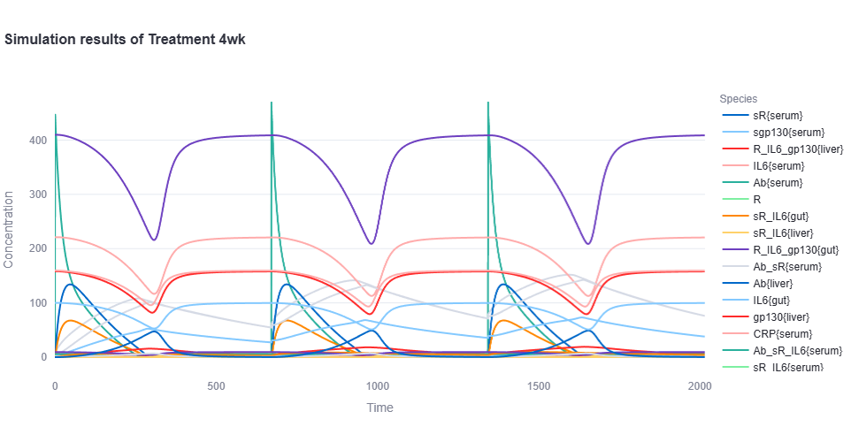

# Example Use Case #1
## Crohn's Disease model

**Paper:**
> Dwivedi G, Fitz L, Hegen M, Martin SW, Harrold J, Heatherington A, Li C. (2014). A multiscale model of interleukin-6-mediated immune regulation in Crohn's disease and its application in drug discovery and development. *CPT Pharmacometrics Syst Pharmacol*, 3(1):e89. doi: 10.1038/psp.2013.64. [PMID: 24402116](https://pubmed.ncbi.nlm.nih.gov/24402116/)

**Model**: [BIOMD0000000537](https://www.ebi.ac.uk/biomodels/BIOMD0000000537)

<hr>

<i>Note: The specific responses to queries may differ from the ones provided here, depending on the release version of Talk2Biomodels and the large language model (LLM) utilized.</i>

<hr>

### General questions about the model

<hr>

**Q1:** Search for a model on BioModels database related to a search term <br>

```
Search for all the BioModels on Crohn's Disease
```

**A1:** 
>| # | BioModel ID | BioModel Name | Format | Submission Date |
>|---|-------------|---------------|---------|-----------------|
>| 1 | BIOMD0000000535 | Dwivedi2014 - Crohns IL6 Disease model - Anti-IL6 Antibody | SBML | 2014-08-04 |
>| 2 | BIOMD0000000536 | Dwivedi2014 - Crohns IL6 Disease model - sgp130 activity | SBML | 2014-08-04 |
>| 3 | BIOMD0000000537 | Dwivedi2014 - Crohns IL6 Disease model - Anti-IL6R Antibody | SBML | 2014-08-04 |


**Q2:** Get model description <br>

```
Briefly describe the BioModel 537
```

**A2:**

>**Description:**
>This model consists of four interconnected models that explore different aspects of Crohn's disease related to Interleukin-6 (IL-6) inhibition. The models include:
>
>- Healthy Volunteer model
>- Crohn's Disease - IL-6 Antibody
>- Crohn's Disease - sgp130FC
>- Crohn's Disease - IL-6Ra Antibody
>The primary focus is on simulating the differential activity of various ligands on IL-6 signaling, which impacts the activity of Signal Transducer and Activator of Transcription 3 (STAT3) and the production of the biomarker C-Reactive Protein (CRP).
>
>The model is detailed in the article titled "A multiscale model of interleukin-6-mediated immune regulation in Crohn's disease and its application in drug discovery and development," published in CPT Pharmacometrics & Systems Pharmacology in 2014.
>
>This model is hosted on the BioModels Database and can be identified by the ID BIOMD0000000537.

**Q3:** Ask about publication data of the model (It will remember the model number) <br>

```
When and where was this model published?
```

**A3:**

> The model was published in the article titled "A multiscale model of interleukin-6-mediated immune regulation in Crohn's disease and its application in drug discovery and development."

>**Publication Details:**
>
>Authors: Dwivedi G, Fitz L, Hegen M, Martin SW, Harrold J, Heatherington A, Li C.
>
>Journal: CPT Pharmacometrics & Systems Pharmacology
>
>Publication Date: 2014
>
>Volume: 3
>
>Article Identifier: e89
>
>Link to Article: PubMed
>
>This study discusses the development of a multiscale systems model for understanding IL-6-mediated immune regulation in Crohn's disease and its implications for drug discovery.

**Q4:** Display all parameters related to drug dosage. <br>

```
Show me the parameters related to drug dosing regimen in the model
```

**A4:** <br>

>The parameters related to the drug dosing regimen in the BioModel 537 include:
>
>- Dose: The amount of drug administered in a single dose.
>- DoseQ2W: The dosage administered every two weeks.
>- Initial for Dose: Initial concentration for the standard dose.
>- Initial for DoseQ2W: Initial concentration for the dosage administered every two weeks.
>- infusionTime: The duration of the drug infusion.

>These parameters are crucial for defining how the drug is administered over time and help in modeling the effects of different dosing schedules on the pharmacokinetics and pharmacodynamics of the drug.

<hr> 

### Interrogate model annotations
TBD (editing and saving annotations)

<hr>

### Model simulation and plotting

**Q5:** Simulate the model for 12 weeks (= 2016 hours), and give the simulation result a name. <br>

```
Simulate the model for 2016 hours with an interval of 2016 hours. Set the initial concentration of Dose to 200 mg. Call this result `Treatment 4wk`.
```

**A5:**<br>
**Figure:**<br>


**Table:**<br>
>| Time | sR{serum} | sgp130{serum} | R_IL6_gp130{liver} | IL6{serum} | Ab{serum} | R | ... |
>|------|------------|---------------|-------------------|------------|-----------|---| ---|
>| 0.0 | 4.253507 | 3.900000 | 6.599359e-05 | 0.000436 | 2.381820e-29 | 0.438236 | ... |
>| 1.0 | 0.000031 | 3.901765 | 6.420660e-05 | 0.000638 | 6.753452e+02 | 0.000178 | ... |
>| 2.0 | 0.000037 | 3.905215 | 6.248857e-05 | 0.000739 | 6.522828e+02 | 0.000070 | ... |
>| 3.0 | 0.000043 | 3.907882 | 6.013415e-05 | 0.000756 | 6.303828e+02 | 0.000049 | ... | 
>| 4.0 | 0.000049 | 3.909825 | 5.762284e-05 | 0.000755 | 6.095828e+02 | 0.000039 | ... | 
>| ... | ... | ... | ... | ... | ... | ... | ... |   

**Q6:** Show only CRP-related species, as it is one of the clinically-relevant measurement for a successful treatment. <br>

```
Plot only CRP-related species.
```

**A6:**<br>
**Figure:**<br>


**Q7:** Review, how drug treatment influences CRP[serum] concentration at any arbitrary time point, e.g. 12 weeks after the initial drug treatment (2016 hours). <br>

```
What is the CRP concentration in the serum after 2016 hours of treatment?
```

<hr>

### Compare two treatment regimens and apply reasoning

**Q8:** Administrate the drug treatment every two weeks by activating the `DoseQ2W` and deactivating `Dose` parameters. <br>  

```
Simulate the model again for 2016 hours with an interval of 2016 hours. Set the initial concentration of `DoseQ2W` to 200 and `Dose` to 0. Call this result `Treatment 2wk`.
```


**Q9:** Compare the CRP values in both aforementioned cases. 'Treatment 2wk' should reduce CRP earlier than 'Treatment 4wk'. <br>

```
Based on the CRP values in serum at the end of the simulation, which treatment would you recommend `Treatment 4wk` or `Treatment 2wk`?
```

<hr>

### Compute the concentration of free drug in blood serum 

**Q10:** Reproduce Figure 4f from the paper for a 500mg dose. <br>

```
Set the initial concentration of 'Dose' to 500 mg and simulate the model for 2016 hours with an interval of 2016. Plot Ab in serum.
```

<hr>

### Simulate two antibodies with varying dissociation affinities

**Q11:** Plot the current trajectory of CRP % suppression with the initial model parameters (`kIL6RUnbind` = 2.5). Compare the CRP suppression after 12 weeks of treatment. The authors expect 100% suppression of CRP after 12 weeks. <br>

```
Simulate the model for 2016 hours with an interval of 2016. Plot the trajectory of CRP % suppression. Save this simulation as `Antibody 2.5`.
```

**Q12:** Set the parameter `kIL6RUnbind` to 250, decreasing the stability of the antibody-IL6R complex. Simulate the model and plot serum CRP % suppression. The authors expect ~10% suppression of CRP after 12 weeks. <br>
_Note: this parameter is not set correctly with this prompt_

```
Simulate the model for 2016 hours with an interval of 2016, but set the parameter `kIL6RUnbind` to 250. Plot the curve of CRP % suppression. Save this simulation as `Antibody 250`.
```


**Q13:** Inquire about the effectiveness of the antibodies. <br>

```
Which antibody 'Antibody 250' or 'Antibody 2.5' is more effective in reducing CRP in the blood serum at the end of the simulation?
```

<hr>

### Parameter scanning
**Q14:** A scan over the parameter `kIL6RUnbind` to evaluate how CRP in serum changes with the stability of the antibody-IL6R complex. <br>

```
How will the concentration of CRP in serum change, if the parameter `kIL6RUnbind` were to be changed from 2.5 to 250 in steps of 20?
```